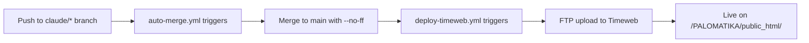

# CLAUDE.md - AI Assistant Guide for Evrium Project

**Last Updated**: 2025-11-15
**Project**: Evrium - Interactive Geometry Learning Platform + CRM System
**Repository**: Palomig/evrium

---

## 📋 Table of Contents

1. [Project Overview](#project-overview)
2. [Repository Structure](#repository-structure)
3. [Technology Stack](#technology-stack)
4. [Development Workflows](#development-workflows)
5. [Code Conventions](#code-conventions)
6. [Database Schema](#database-schema)
7. [API Guidelines](#api-guidelines)
8. [Security Practices](#security-practices)
9. [Testing Guidelines](#testing-guidelines)
10. [Deployment Process](#deployment-process)
11. [Common Tasks](#common-tasks)
12. [Troubleshooting](#troubleshooting)

---

## 🎯 Project Overview

### Dual-Purpose Application

Evrium consists of **two integrated systems**:

#### 1. Interactive Geometry Learning Platform (Root)
- **Purpose**: Educational website for geometry (grades 7-9) based on Atanasyan textbook
- **Features**: Interactive SVG visualizations, chapter navigation, exercise editor, documentation
- **Tech**: PHP + Vanilla JavaScript + Bootstrap 5
- **Entry Point**: `index.php`

#### 2. Evrium CRM (Tutoring Management System)
- **Purpose**: Full-featured CRM for tutors managing students, lessons, payments, skills tracking
- **Features**: Student CRUD, lesson tracking, financial management, REST API, PDF reports
- **Tech**: PHP 8.x + MySQL + Bootstrap 5
- **Location**: `/crm/` directory
- **Entry Point**: `crm/login.php`

### Key Metrics
- **Database Tables**: 8 (+ 2 views + 3 triggers)
- **API Endpoints**: 10+ REST endpoints
- **Curriculum**: 12 chapters across 3 grades (7-9)
- **Skills Tracked**: 5 core math competencies (extendable)
- **Roles**: Teacher, SuperAdmin

---

## 📂 Repository Structure

```
evrium/
├── 🌐 GEOMETRY PLATFORM (Root Level)
│   ├── index.php                    # Homepage with class selection
│   ├── chapter.php                  # Chapter display with topics list
│   ├── topic.php                    # Individual topic with theory/examples
│   ├── examples.php                 # Interactive exercise gallery
│   ├── editor.php                   # JSON-based exercise editor
│   ├── docs.php                     # Complete documentation
│   ├── config.php                   # ⭐ MASSIVE curriculum data (96KB)
│   │                                #    All 12 chapters, topics, theory, examples
│   │
├── 📚 CRM SYSTEM
│   └── crm/
│       ├── login.php                # Apple-style login page
│       ├── logout.php               # Session cleanup
│       ├── dashboard.php            # Teacher dashboard
│       ├── database.sql             # ⭐ Complete DB schema (with triggers)
│       ├── .htaccess                # Apache URL rewriting
│       ├── README.md                # CRM documentation (Russian)
│       ├── INSTALL.md               # Installation guide
│       │
│       ├── config/                  # ⭐ CORE CONFIGURATION
│       │   ├── db.php               # Database abstraction layer (PDO)
│       │   ├── auth.php             # Authentication & authorization
│       │   └── helpers.php          # Utility functions
│       │
│       └── api/                     # REST API Endpoints
│           └── students.php         # Student CRUD + filters/search
│
├── 📄 DOCUMENTATION
│   └── docs/
│       └── claude.md                # Russian tech spec (for reference)
│
├── 🎨 STATIC ASSETS (Root)
│   ├── crm.html, crm-script.js, crm-style.css
│   ├── editor.html, examples.html, index.html
│   └── robots.txt
│
├── 🚀 CI/CD & DEPLOYMENT
│   ├── .github/
│   │   └── workflows/
│   │       ├── auto-merge.yml       # Auto-merge claude/** → main
│   │       └── deploy-timeweb.yml   # FTP deploy to Timeweb hosting
│   │
│   └── DEPLOYMENT.md                # Deployment documentation
│
└── 📦 EXERCISE ARCHIVES
    ├── 1-6.zip, 7-12.zip, 69-74.zip # Pre-built exercise packs
```

---

## 🛠 Technology Stack

### Backend
| Component | Technology | Notes |
|-----------|-----------|-------|
| **Language** | PHP 8.x | Use modern PHP 8+ features |
| **Database** | MySQL 5.7+ | InnoDB engine, UTF8MB4 charset |
| **DB Access** | PDO | Always use prepared statements |
| **Sessions** | PHP Sessions | HTTPOnly, secure cookies |
| **Password** | `password_hash()` | PASSWORD_DEFAULT (bcrypt) |

### Frontend
| Component | Technology | Notes |
|-----------|-----------|-------|
| **Framework** | Bootstrap 5 | Loaded via CDN |
| **JavaScript** | Vanilla JS | No framework (keep it simple) |
| **Icons** | Font Awesome | CDN-based |
| **Charts** | Chart.js | For progress visualization |
| **Visualization** | SVG | For geometry diagrams |

### DevOps
| Component | Technology | Notes |
|-----------|-----------|-------|
| **CI/CD** | GitHub Actions | Auto-merge + FTP deploy |
| **Hosting** | Timeweb | Shared hosting via FTP |
| **Deploy Path** | `/PALOMATIKA/public_html/` | |
| **Web Server** | Apache | .htaccess configured |

---

## 🔄 Development Workflows

### Branch Strategy

**CRITICAL**: All development happens on Claude-specific branches:

```
claude/claude-md-{session-id}-{unique-id}
```

**Example**: `claude/claude-md-mhzka2eubzn0cg1j-01EEf1yfqC2HN82csG6kygKB`

### Workflow Steps

1. **Development Phase**
   - Work on designated `claude/*` branch
   - Make all changes, test locally
   - Commit with clear messages

2. **Commit Messages**
   - **Format**: `<type>: <short description>`
   - **Types**: `feat`, `fix`, `refactor`, `docs`, `style`, `test`, `chore`
   - **Examples**:
     - `feat: Add payment filtering API endpoint`
     - `fix: Correct student balance calculation trigger`
     - `docs: Update CLAUDE.md with API guidelines`
     - `refactor: Extract auth logic to separate module`

3. **Push to Remote**
   ```bash
   git add .
   git commit -m "feat: Add student skills tracking"
   git push -u origin claude/claude-md-{session-id}
   ```
   - **MUST** use `-u origin` flag
   - Branch MUST start with `claude/` and end with session ID
   - **Retry Logic**: Up to 4 retries with exponential backoff (2s, 4s, 8s, 16s) if network errors

4. **Auto-Merge to Main**
   - GitHub Action automatically merges `claude/**` → `main`
   - Merge commit created with `--no-ff`
   - Triggers deployment workflow

5. **Auto-Deploy to Timeweb**
   - FTP deployment to `/PALOMATIKA/public_html/`
   - Excludes: `.git`, `.github`, `node_modules`, `.DS_Store`
   - Deployment takes 1-2 minutes

### Git Best Practices

**DO**:
- ✅ Develop on `claude/*` branches only
- ✅ Push with `-u origin <branch-name>`
- ✅ Use descriptive commit messages
- ✅ Test locally before pushing
- ✅ Keep commits atomic and focused

**DON'T**:
- ❌ Push to `main` directly (will fail)
- ❌ Force push (`--force`)
- ❌ Skip hooks (`--no-verify`)
- ❌ Amend others' commits
- ❌ Use generic messages like "fix", "update"

---

## 📝 Code Conventions

### PHP Conventions

#### File Organization
```php
<?php
// 1. Require/include statements
require_once __DIR__ . '/config/db.php';
require_once __DIR__ . '/config/auth.php';

// 2. Session management (if needed)
session_start();

// 3. Authentication checks
if (!isLoggedIn()) {
    header('Location: login.php');
    exit;
}

// 4. Main logic
$students = dbQuery("SELECT * FROM students WHERE teacher_id = ?", [$teacherId]);

// 5. Response (HTML or JSON)
?>
```

#### Naming Conventions
| Type | Convention | Example |
|------|-----------|---------|
| **Variables** | camelCase | `$studentId`, `$teacherName` |
| **Functions** | camelCase | `getCurrentUser()`, `validateInput()` |
| **Constants** | UPPER_SNAKE_CASE | `DB_HOST`, `SESSION_TIMEOUT` |
| **Classes** | PascalCase | `StudentManager`, `ReportGenerator` |
| **Files** | lowercase, hyphen-separated | `student-profile.php`, `api-helpers.php` |
| **Database Tables** | snake_case | `students`, `student_skills`, `api_tokens` |
| **Database Columns** | snake_case | `teacher_id`, `created_at`, `password_hash` |

#### Security Practices
```php
// ✅ ALWAYS use prepared statements
$stmt = $pdo->prepare("SELECT * FROM students WHERE id = ?");
$stmt->execute([$studentId]);

// ✅ ALWAYS escape output
echo htmlspecialchars($student['name'], ENT_QUOTES, 'UTF-8');

// ✅ ALWAYS validate input
$studentId = filter_input(INPUT_GET, 'id', FILTER_VALIDATE_INT);
if (!$studentId) {
    http_response_code(400);
    exit('Invalid ID');
}

// ✅ ALWAYS check authentication
if (!isLoggedIn()) {
    http_response_code(401);
    exit('Unauthorized');
}

// ✅ ALWAYS verify authorization
if (!checkResourceOwner($student['teacher_id'])) {
    http_response_code(403);
    exit('Forbidden');
}
```

### JavaScript Conventions

#### Code Style
```javascript
// Use const/let, never var
const studentId = 123;
let balance = 0;

// Use arrow functions for callbacks
students.filter(s => s.balance < 0);

// Use template literals
const message = `Student ${name} has balance ${balance}`;

// Use async/await for API calls
async function fetchStudents() {
    const response = await fetch('/crm/api/students.php?action=list');
    const data = await response.json();
    return data;
}

// Handle errors properly
try {
    const students = await fetchStudents();
    renderStudents(students);
} catch (error) {
    console.error('Failed to fetch students:', error);
    showErrorMessage('Unable to load students');
}
```

#### DOM Manipulation
```javascript
// Use modern DOM methods
document.querySelector('.student-list');
document.querySelectorAll('.student-item');
element.classList.add('active');
element.addEventListener('click', handleClick);

// Avoid jQuery (not used in this project)
```

### SQL Conventions

#### Query Style
```sql
-- Use uppercase for SQL keywords
SELECT s.id, s.name, s.balance, t.name AS teacher_name
FROM students s
LEFT JOIN admins t ON s.teacher_id = t.id
WHERE s.balance < 0
ORDER BY s.created_at DESC
LIMIT 20 OFFSET 0;

-- Always use meaningful aliases
-- Always specify JOIN conditions explicitly
-- Use prepared statement placeholders (?)
```

#### Table Design
- **Primary Keys**: Always `id INT AUTO_INCREMENT PRIMARY KEY`
- **Foreign Keys**: Always name with `_id` suffix (e.g., `teacher_id`, `student_id`)
- **Timestamps**: Use `DATETIME` type, named `created_at`, `updated_at`
- **Soft Deletes**: Use `active BOOLEAN DEFAULT 1` or `deleted_at DATETIME NULL`
- **Enums**: Use for fixed sets (e.g., `ENUM('teacher', 'superadmin')`)
- **Decimals**: Use `DECIMAL(8,2)` for currency (e.g., balance, amount)
- **Indexes**: Add on foreign keys and frequently queried columns

---

## 🗄️ Database Schema

### Core Tables

#### `admins` (Teachers & Administrators)
```sql
CREATE TABLE admins (
    id INT AUTO_INCREMENT PRIMARY KEY,
    username VARCHAR(50) UNIQUE NOT NULL,
    password_hash VARCHAR(255) NOT NULL,
    name VARCHAR(100) NOT NULL,
    role ENUM('teacher', 'superadmin') DEFAULT 'teacher',
    active BOOLEAN DEFAULT 1,
    telegram_id BIGINT UNIQUE NULL,
    created_at DATETIME DEFAULT CURRENT_TIMESTAMP
);
```
- **Roles**: `teacher` (manages own students), `superadmin` (manages all)
- **Default Credentials**: username=`admin`, password=`admin123` (change in production!)

#### `students` (Student Records)
```sql
CREATE TABLE students (
    id INT AUTO_INCREMENT PRIMARY KEY,
    teacher_id INT NOT NULL,
    name VARCHAR(100) NOT NULL,
    class INT NOT NULL,
    phone VARCHAR(20),
    schedule VARCHAR(255),
    goal VARCHAR(255),
    comment TEXT,
    balance DECIMAL(8,2) DEFAULT 0.00,
    status ENUM('оплачено', 'ожидает', 'задолженность') DEFAULT 'ожидает',
    created_at DATETIME DEFAULT CURRENT_TIMESTAMP,
    FOREIGN KEY (teacher_id) REFERENCES admins(id) ON DELETE CASCADE
);
```
- **Balance**: Updated automatically by payment triggers
- **Status**: Auto-updated by `update_student_status` trigger

#### `skills` (Competency Framework)
```sql
CREATE TABLE skills (
    id INT AUTO_INCREMENT PRIMARY KEY,
    name VARCHAR(100) NOT NULL,
    category VARCHAR(100),
    class INT,
    description TEXT,
    INDEX idx_class (class),
    INDEX idx_category (category)
);
```
- **Pre-populated**: 5 core math skills (linear equations, geometry, Pythagorean theorem, quadratic equations, trigonometry)
- **Extendable**: Teachers/admins can add custom skills

#### `student_skills` (Student Competency Tracking)
```sql
CREATE TABLE student_skills (
    id INT AUTO_INCREMENT PRIMARY KEY,
    student_id INT NOT NULL,
    skill_id INT NOT NULL,
    level TINYINT DEFAULT 0,  -- 0-5 scale
    last_update DATE,
    comment TEXT,
    FOREIGN KEY (student_id) REFERENCES students(id) ON DELETE CASCADE,
    FOREIGN KEY (skill_id) REFERENCES skills(id) ON DELETE CASCADE,
    UNIQUE KEY unique_student_skill (student_id, skill_id)
);
```
- **Level Scale**: 0 (not started) to 5 (mastered)

#### `lessons` (Lesson Records)
```sql
CREATE TABLE lessons (
    id INT AUTO_INCREMENT PRIMARY KEY,
    student_id INT NOT NULL,
    teacher_id INT NOT NULL,
    date DATE NOT NULL,
    topics TEXT,
    homework_given BOOLEAN DEFAULT 0,
    homework_done BOOLEAN DEFAULT 0,
    comment TEXT,
    paid BOOLEAN DEFAULT 0,
    rating TINYINT,  -- 1-5 scale
    FOREIGN KEY (student_id) REFERENCES students(id) ON DELETE CASCADE,
    FOREIGN KEY (teacher_id) REFERENCES admins(id) ON DELETE CASCADE,
    INDEX idx_date (date)
);
```

#### `payments` (Payment Records)
```sql
CREATE TABLE payments (
    id INT AUTO_INCREMENT PRIMARY KEY,
    student_id INT NOT NULL,
    teacher_id INT NOT NULL,
    date DATE NOT NULL,
    amount DECIMAL(8,2) NOT NULL,
    method VARCHAR(50),  -- 'наличные', 'перевод', etc.
    comment TEXT,
    FOREIGN KEY (student_id) REFERENCES students(id) ON DELETE CASCADE,
    FOREIGN KEY (teacher_id) REFERENCES admins(id) ON DELETE CASCADE,
    INDEX idx_date (date)
);
```

#### `materials` (Learning Materials)
```sql
CREATE TABLE materials (
    id INT AUTO_INCREMENT PRIMARY KEY,
    teacher_id INT NOT NULL,
    name VARCHAR(100) NOT NULL,
    category VARCHAR(100),
    class INT,
    type ENUM('pdf', 'image') NOT NULL,
    path VARCHAR(255) NOT NULL,
    description TEXT,
    created_at DATETIME DEFAULT CURRENT_TIMESTAMP,
    FOREIGN KEY (teacher_id) REFERENCES admins(id) ON DELETE CASCADE
);
```

#### `api_tokens` (API Authentication)
```sql
CREATE TABLE api_tokens (
    id INT AUTO_INCREMENT PRIMARY KEY,
    admin_id INT NOT NULL,
    token VARCHAR(255) UNIQUE NOT NULL,
    expires_at DATETIME NOT NULL,
    created_at DATETIME DEFAULT CURRENT_TIMESTAMP,
    FOREIGN KEY (admin_id) REFERENCES admins(id) ON DELETE CASCADE
);
```
- **Default Expiry**: 30 days from creation
- **Format**: Random 64-character hex string

### Database Views

#### `teacher_stats` (Per-Teacher Analytics)
```sql
CREATE VIEW teacher_stats AS
SELECT
    a.id AS teacher_id,
    a.name AS teacher_name,
    COUNT(DISTINCT s.id) AS student_count,
    COUNT(l.id) AS lesson_count,
    COALESCE(SUM(p.amount), 0) AS total_revenue,
    AVG(l.rating) AS avg_rating
FROM admins a
LEFT JOIN students s ON a.id = s.teacher_id
LEFT JOIN lessons l ON a.id = l.teacher_id
LEFT JOIN payments p ON a.id = p.teacher_id
GROUP BY a.id;
```

#### `student_stats` (Per-Student Analytics)
```sql
CREATE VIEW student_stats AS
SELECT
    s.id AS student_id,
    s.name AS student_name,
    COUNT(l.id) AS lesson_count,
    SUM(l.homework_done) AS homework_completed,
    AVG(l.rating) AS avg_rating,
    s.balance
FROM students s
LEFT JOIN lessons l ON s.id = l.student_id
GROUP BY s.id;
```

### Database Triggers

#### `after_payment_insert` (Update Balance on Payment)
```sql
CREATE TRIGGER after_payment_insert
AFTER INSERT ON payments
FOR EACH ROW
BEGIN
    UPDATE students
    SET balance = balance + NEW.amount
    WHERE id = NEW.student_id;
END;
```

#### `after_payment_delete` (Update Balance on Payment Deletion)
```sql
CREATE TRIGGER after_payment_delete
AFTER DELETE ON payments
FOR EACH ROW
BEGIN
    UPDATE students
    SET balance = balance - OLD.amount
    WHERE id = OLD.student_id;
END;
```

#### `update_student_status` (Auto-Update Payment Status)
```sql
CREATE TRIGGER update_student_status
AFTER UPDATE ON students
FOR EACH ROW
BEGIN
    IF NEW.balance > 0 THEN
        UPDATE students SET status = 'оплачено' WHERE id = NEW.id;
    ELSEIF NEW.balance < 0 THEN
        UPDATE students SET status = 'задолженность' WHERE id = NEW.id;
    ELSE
        UPDATE students SET status = 'ожидает' WHERE id = NEW.id;
    END IF;
END;
```

---

## 🔌 API Guidelines

### Authentication

**Session-Based** (for web UI):
```php
session_start();
if (!isLoggedIn()) {
    http_response_code(401);
    exit(json_encode(['error' => 'Unauthorized']));
}
```

**Token-Based** (for API):
```php
$token = getBearerToken();  // Extracts from Authorization header
$admin = validateAPIToken($token);
if (!$admin) {
    http_response_code(401);
    exit(json_encode(['error' => 'Invalid or expired token']));
}
```

### Request Format

**GET Requests** (query parameters):
```
GET /crm/api/students.php?action=list&teacher_id=5&status=задолженность&page=1
```

**POST Requests** (JSON body):
```bash
curl -X POST /crm/api/students.php?action=add \
  -H "Authorization: Bearer TOKEN" \
  -H "Content-Type: application/json" \
  -d '{
    "name": "Иван Петров",
    "class": 9,
    "phone": "+79991234567",
    "schedule": "Пн, Ср 16:00",
    "goal": "Подготовка к ОГЭ"
  }'
```

### Response Format

**Success Response**:
```json
{
  "success": true,
  "data": {
    "id": 123,
    "name": "Иван Петров",
    "class": 9,
    "balance": 5000.00
  }
}
```

**Error Response**:
```json
{
  "success": false,
  "error": "Student not found",
  "code": 404
}
```

### HTTP Status Codes

| Code | Meaning | When to Use |
|------|---------|-------------|
| **200** | OK | Successful GET/POST/PUT |
| **201** | Created | Successful resource creation |
| **400** | Bad Request | Invalid input data |
| **401** | Unauthorized | Missing/invalid authentication |
| **403** | Forbidden | Authenticated but no permission |
| **404** | Not Found | Resource doesn't exist |
| **500** | Internal Server Error | Unexpected server error |

### API Endpoint Structure

**File**: `/crm/api/{resource}.php`

**Pattern**:
```php
<?php
require_once __DIR__ . '/../config/db.php';
require_once __DIR__ . '/../config/auth.php';

// Set JSON response headers
header('Content-Type: application/json');

// Authenticate
$admin = validateAPIToken(getBearerToken());
if (!$admin) {
    http_response_code(401);
    exit(json_encode(['error' => 'Unauthorized']));
}

// Get action
$action = $_GET['action'] ?? '';

// Route by action
switch ($action) {
    case 'list':
        handleList($admin);
        break;
    case 'get':
        handleGet($admin);
        break;
    case 'add':
        handleAdd($admin);
        break;
    case 'update':
        handleUpdate($admin);
        break;
    case 'delete':
        handleDelete($admin);
        break;
    default:
        http_response_code(400);
        echo json_encode(['error' => 'Invalid action']);
}

function handleList($admin) {
    // Implement list logic
    $teacherId = $admin['role'] === 'superadmin'
        ? ($_GET['teacher_id'] ?? null)
        : $admin['id'];

    $query = "SELECT * FROM students";
    $params = [];

    if ($teacherId) {
        $query .= " WHERE teacher_id = ?";
        $params[] = $teacherId;
    }

    $students = dbQuery($query, $params);
    echo json_encode(['success' => true, 'data' => $students]);
}

// Implement other handlers...
```

### Existing API Endpoints

**Students API** (`/crm/api/students.php`):

| Action | Method | Parameters | Description |
|--------|--------|------------|-------------|
| `list` | GET | `teacher_id`, `status`, `search`, `page`, `per_page` | List students with filters |
| `get` | GET | `id` | Get single student |
| `add` | POST | JSON body | Create new student |
| `update` | POST | JSON body with `id` | Update student |
| `delete` | POST | JSON body with `id` | Delete student |
| `stats` | GET | - | Get student statistics |

**Planned Endpoints** (need implementation):
- `/crm/api/lessons.php` - Lesson CRUD
- `/crm/api/payments.php` - Payment CRUD
- `/crm/api/skills.php` - Skills management
- `/crm/api/reports.php` - Report generation
- `/crm/api/telegram.php` - Telegram bot integration

---

## 🔐 Security Practices

### Authentication & Authorization

**Always Check Both**:
```php
// 1. Authentication (who are you?)
if (!isLoggedIn()) {
    http_response_code(401);
    exit('Unauthorized');
}

// 2. Authorization (can you do this?)
$student = dbQueryOne("SELECT teacher_id FROM students WHERE id = ?", [$studentId]);
if (!checkResourceOwner($student['teacher_id'])) {
    http_response_code(403);
    exit('Forbidden');
}
```

### Input Validation

**Server-Side Validation (Required)**:
```php
// Validate integer IDs
$studentId = filter_input(INPUT_GET, 'id', FILTER_VALIDATE_INT);
if (!$studentId) {
    http_response_code(400);
    exit('Invalid ID');
}

// Validate strings
$name = trim($_POST['name'] ?? '');
if (empty($name) || strlen($name) > 100) {
    http_response_code(400);
    exit('Name must be 1-100 characters');
}

// Validate enums
$role = $_POST['role'] ?? '';
if (!in_array($role, ['teacher', 'superadmin'])) {
    http_response_code(400);
    exit('Invalid role');
}

// Validate email
$email = filter_input(INPUT_POST, 'email', FILTER_VALIDATE_EMAIL);
if (!$email) {
    http_response_code(400);
    exit('Invalid email');
}
```

### SQL Injection Prevention

**Always Use Prepared Statements**:
```php
// ✅ CORRECT
$stmt = $pdo->prepare("SELECT * FROM students WHERE id = ?");
$stmt->execute([$studentId]);

// ✅ CORRECT (named parameters)
$stmt = $pdo->prepare("SELECT * FROM students WHERE name = :name AND class = :class");
$stmt->execute(['name' => $name, 'class' => $class]);

// ❌ NEVER DO THIS
$query = "SELECT * FROM students WHERE id = $studentId";  // VULNERABLE!
$result = $pdo->query($query);
```

### XSS Prevention

**Escape All Output**:
```php
// In HTML context
echo htmlspecialchars($student['name'], ENT_QUOTES, 'UTF-8');

// In JavaScript context
echo json_encode($student['name'], JSON_HEX_TAG | JSON_HEX_AMP);

// In URL context
echo urlencode($student['name']);
```

### CSRF Protection

**Generate Token**:
```php
// In form
$csrfToken = generateCSRFToken();
echo "<input type='hidden' name='csrf_token' value='" . htmlspecialchars($csrfToken) . "'>";
```

**Validate Token**:
```php
// On form submission
if (!validateCSRFToken($_POST['csrf_token'] ?? '')) {
    http_response_code(403);
    exit('Invalid CSRF token');
}
```

### Password Security

**Hash Passwords**:
```php
// On registration/password change
$passwordHash = password_hash($password, PASSWORD_DEFAULT);
dbExecute("INSERT INTO admins (username, password_hash) VALUES (?, ?)", [$username, $passwordHash]);
```

**Verify Passwords**:
```php
// On login
$admin = dbQueryOne("SELECT * FROM admins WHERE username = ?", [$username]);
if ($admin && password_verify($password, $admin['password_hash'])) {
    // Success
    $_SESSION['admin_id'] = $admin['id'];
} else {
    // Failure
    exit('Invalid credentials');
}
```

### API Token Security

**Generate Secure Tokens**:
```php
// 64-character random hex string
$token = bin2hex(random_bytes(32));
$expiresAt = date('Y-m-d H:i:s', strtotime('+30 days'));
dbExecute("INSERT INTO api_tokens (admin_id, token, expires_at) VALUES (?, ?, ?)",
    [$adminId, $token, $expiresAt]);
```

**Validate Tokens**:
```php
function validateAPIToken($token) {
    if (!$token) return null;

    $result = dbQueryOne(
        "SELECT a.* FROM admins a
         JOIN api_tokens t ON a.id = t.admin_id
         WHERE t.token = ? AND t.expires_at > NOW()",
        [$token]
    );

    return $result;
}
```

---

## 🧪 Testing Guidelines

### Current State
- **No formal test suite** exists yet
- Manual testing only

### Recommended Testing Stack

**Backend (PHP)**:
- **PHPUnit** for unit/integration tests
- Test files: `/tests/` directory
- Naming: `{ClassOrFile}Test.php`

**Frontend (JavaScript)**:
- **Jest** for unit tests
- Test files: `__tests__/` or `*.test.js`

**API Testing**:
- **Postman Collections** for API endpoint testing
- **cURL scripts** for smoke tests

### Testing Checklist (Manual)

**Before Committing**:
- [ ] Test CRUD operations for affected resources
- [ ] Verify authentication/authorization logic
- [ ] Check SQL queries return correct results
- [ ] Validate input handling (edge cases, invalid data)
- [ ] Test error responses (400, 401, 403, 404, 500)
- [ ] Verify no SQL injection vulnerabilities
- [ ] Check XSS prevention on output
- [ ] Test on both teacher and superadmin roles

**Before Deploying**:
- [ ] Check database migrations (if any)
- [ ] Verify `.htaccess` configuration
- [ ] Test on staging environment first
- [ ] Check FTP deployment excludes correct files
- [ ] Verify GitHub Secrets are set correctly

### Example Test Cases

**Student CRUD**:
1. Create student → verify in database
2. Get student → verify correct data returned
3. Update student → verify changes persisted
4. Delete student → verify cascade deletion (lessons, payments, student_skills)
5. List students → verify filtering/pagination works
6. Test with invalid data → verify 400 errors
7. Test unauthorized access → verify 401/403 errors

**Payment Operations**:
1. Add payment → verify balance updated (trigger)
2. Delete payment → verify balance reverted (trigger)
3. Check status update → verify status enum correct
4. Test negative balance → verify "задолженность" status
5. Test positive balance → verify "оплачено" status

---

## 🚀 Deployment Process

### Prerequisites

**GitHub Secrets** (set in repository settings):
- `FTP_SERVER` - Timeweb FTP hostname
- `FTP_USERNAME` - FTP login
- `FTP_PASSWORD` - FTP password

**Database Setup**:
1. Create database: `evrium_crm`
2. Import schema: `mysql -u root -p evrium_crm < crm/database.sql`
3. Update credentials in `crm/config/db.php`

### Automated Deployment Flow



**Timeline**: ~2-3 minutes from push to live

### Manual Deployment (if needed)

**Via GitHub Actions**:
1. Go to Actions tab
2. Select "Deploy to Timeweb"
3. Click "Run workflow"
4. Select branch (usually `main`)
5. Click "Run workflow"

**Via FTP Client** (emergency):
1. Connect to Timeweb FTP
2. Navigate to `/PALOMATIKA/public_html/`
3. Upload files (exclude `.git`, `.github`, `README.md`)
4. Set permissions: `755` for directories, `644` for files
5. Verify `crm/config/db.php` has correct credentials

### Post-Deployment Checklist

- [ ] Visit homepage: `https://your-domain.com/`
- [ ] Visit CRM login: `https://your-domain.com/crm/login.php`
- [ ] Test login with default credentials
- [ ] Check database connection
- [ ] Verify API endpoint: `/crm/api/students.php?action=list`
- [ ] Check `.htaccess` is working (clean URLs)
- [ ] Verify file permissions (writable directories)

### Rollback Procedure

**If deployment fails**:
1. Check GitHub Actions logs for errors
2. Revert merge commit on `main` branch:
   ```bash
   git revert HEAD
   git push origin main
   ```
3. Auto-deployment will trigger with reverted state
4. Investigate and fix issue on new `claude/*` branch

---

## 🛠️ Common Tasks

### Adding a New Student (via API)

```bash
curl -X POST "https://your-domain.com/crm/api/students.php?action=add" \
  -H "Authorization: Bearer YOUR_TOKEN" \
  -H "Content-Type: application/json" \
  -d '{
    "name": "Мария Иванова",
    "class": 8,
    "phone": "+79991234567",
    "schedule": "Вт, Чт 15:00",
    "goal": "Улучшить оценки по геометрии",
    "comment": "Проблемы с теоремами"
  }'
```

### Adding a New Lesson

```php
$lessonId = dbExecute(
    "INSERT INTO lessons (student_id, teacher_id, date, topics, homework_given, rating)
     VALUES (?, ?, ?, ?, ?, ?)",
    [$studentId, $teacherId, $date, $topics, 1, 4]
);
```

### Recording a Payment

```php
// Payment is automatically added to balance via trigger
$paymentId = dbExecute(
    "INSERT INTO payments (student_id, teacher_id, date, amount, method, comment)
     VALUES (?, ?, ?, ?, ?, ?)",
    [$studentId, $teacherId, $date, 5000.00, 'перевод', 'Оплата за октябрь']
);
```

### Updating Student Skill Level

```php
dbExecute(
    "INSERT INTO student_skills (student_id, skill_id, level, last_update, comment)
     VALUES (?, ?, ?, CURDATE(), ?)
     ON DUPLICATE KEY UPDATE level = ?, last_update = CURDATE(), comment = ?",
    [$studentId, $skillId, $newLevel, $comment, $newLevel, $comment]
);
```

### Generating Student Report (Conceptual)

```php
// Get all lessons for student in date range
$lessons = dbQuery(
    "SELECT * FROM lessons
     WHERE student_id = ? AND date BETWEEN ? AND ?
     ORDER BY date ASC",
    [$studentId, $startDate, $endDate]
);

// Calculate statistics
$totalLessons = count($lessons);
$homeworkCompleted = array_sum(array_column($lessons, 'homework_done'));
$avgRating = array_sum(array_column($lessons, 'rating')) / $totalLessons;

// Get skills progress
$skills = dbQuery(
    "SELECT sk.name, ss.level, ss.comment
     FROM student_skills ss
     JOIN skills sk ON ss.skill_id = sk.id
     WHERE ss.student_id = ?",
    [$studentId]
);

// Generate PDF (using library like TCPDF or FPDF)
// ... PDF generation code ...
```

### Adding a New Admin/Teacher

```php
$passwordHash = password_hash('secure_password_123', PASSWORD_DEFAULT);
$adminId = dbExecute(
    "INSERT INTO admins (username, password_hash, name, role, active)
     VALUES (?, ?, ?, ?, 1)",
    ['ivanov', $passwordHash, 'Иван Иванов', 'teacher']
);
```

### Creating an API Token

```php
$token = bin2hex(random_bytes(32));
$expiresAt = date('Y-m-d H:i:s', strtotime('+30 days'));

dbExecute(
    "INSERT INTO api_tokens (admin_id, token, expires_at)
     VALUES (?, ?, ?)",
    [$adminId, $token, $expiresAt]
);

echo "Your API token: " . $token;
```

---

## 🐛 Troubleshooting

### Database Connection Issues

**Error**: "SQLSTATE[HY000] [2002] Connection refused"

**Solutions**:
1. Check `crm/config/db.php` credentials
2. Verify MySQL service is running: `systemctl status mysql`
3. Check MySQL port: `netstat -an | grep 3306`
4. Verify user has correct permissions:
   ```sql
   GRANT ALL ON evrium_crm.* TO 'username'@'localhost';
   FLUSH PRIVILEGES;
   ```

### Authentication Not Working

**Symptom**: Login always fails even with correct credentials

**Solutions**:
1. Check session is started: `session_start()` at top of file
2. Verify password hash in database:
   ```sql
   SELECT username, password_hash FROM admins;
   ```
3. Test password verification:
   ```php
   var_dump(password_verify('admin123', $admin['password_hash']));
   ```
4. Clear browser cookies/session storage

### API Returns 401 Unauthorized

**Symptom**: API calls fail with 401 even with valid token

**Solutions**:
1. Check token exists in database:
   ```sql
   SELECT * FROM api_tokens WHERE token = 'YOUR_TOKEN';
   ```
2. Verify token not expired:
   ```sql
   SELECT * FROM api_tokens WHERE expires_at > NOW();
   ```
3. Check `Authorization` header format: `Bearer YOUR_TOKEN` (with space)
4. Verify token extraction in `getBearerToken()` function

### .htaccess Not Working

**Symptom**: URLs like `/crm/api/students` return 404

**Solutions**:
1. Enable mod_rewrite: `a2enmod rewrite && systemctl restart apache2`
2. Check `.htaccess` file exists in `/crm/` directory
3. Verify AllowOverride is set:
   ```apache
   <Directory /var/www/html>
       AllowOverride All
   </Directory>
   ```
4. Test with full URL: `/crm/api/students.php?action=list`

### FTP Deployment Fails

**Symptom**: GitHub Action fails at "Sync files" step

**Solutions**:
1. Verify GitHub Secrets are set correctly
2. Test FTP credentials manually with FileZilla
3. Check server path exists: `/PALOMATIKA/public_html/`
4. Verify FTP user has write permissions
5. Check GitHub Actions logs for specific error

### Student Balance Not Updating

**Symptom**: Payments added but balance stays 0

**Solutions**:
1. Check triggers exist:
   ```sql
   SHOW TRIGGERS LIKE 'payments';
   ```
2. Re-create triggers from `database.sql`
3. Manually update balance:
   ```sql
   UPDATE students s
   SET balance = (SELECT COALESCE(SUM(amount), 0) FROM payments WHERE student_id = s.id)
   WHERE id = ?;
   ```

### Large File Upload Fails

**Symptom**: Material upload fails for PDF > 2MB

**Solutions**:
1. Increase PHP limits in `php.ini`:
   ```ini
   upload_max_filesize = 20M
   post_max_size = 20M
   max_execution_time = 300
   ```
2. Restart web server: `systemctl restart apache2`
3. Check `.htaccess` doesn't override limits

---

## 📚 Additional Resources

### Documentation Files
- **`crm/README.md`** - CRM system overview (Russian)
- **`crm/INSTALL.md`** - Installation instructions
- **`docs/claude.md`** - Technical specification (Russian)
- **`DEPLOYMENT.md`** - Deployment documentation

### Geometry Platform Data
- **`config.php`** - Complete curriculum (12 chapters, 3 grades)
- Chapters I-IV: Grade 7
- Chapters V-VIII: Grade 8
- Chapters IX-XII: Grade 9

### Database Schema
- **`crm/database.sql`** - Complete schema with triggers and views

### Important Functions

**Database** (`crm/config/db.php`):
- `dbQuery($sql, $params)` - Execute SELECT query, return all rows
- `dbQueryOne($sql, $params)` - Execute SELECT query, return first row
- `dbExecute($sql, $params)` - Execute INSERT/UPDATE/DELETE, return lastInsertId
- `dbBeginTransaction()`, `dbCommit()`, `dbRollback()` - Transaction control

**Authentication** (`crm/config/auth.php`):
- `isLoggedIn()` - Check if user is authenticated
- `getCurrentUserId()`, `getCurrentUserRole()`, `getCurrentUserName()` - Get session data
- `isSuperAdmin()`, `isTeacher()` - Role checks
- `login($username, $password)` - Authenticate user
- `logout()` - End session
- `generateAPIToken($adminId)` - Create new API token
- `validateAPIToken($token)` - Verify API token
- `checkResourceOwner($teacherId)` - Verify user owns resource

---

## 🎯 AI Assistant Guidelines

### When Working on This Project

1. **Always Read First**
   - Read relevant PHP files before editing
   - Check database schema before writing queries
   - Review existing API patterns before adding endpoints

2. **Follow Existing Patterns**
   - Use `dbQuery()`/`dbExecute()` for database access
   - Use `isLoggedIn()` for authentication checks
   - Use `checkResourceOwner()` for authorization
   - Follow existing API response format

3. **Security First**
   - Never concatenate user input into SQL queries
   - Always escape output with `htmlspecialchars()`
   - Always validate input (type, length, format)
   - Always check authentication AND authorization

4. **Test Before Committing**
   - Test CRUD operations manually
   - Test with different roles (teacher vs superadmin)
   - Test error cases (invalid input, unauthorized access)
   - Verify database triggers work correctly

5. **Commit Properly**
   - Use conventional commit messages
   - Make atomic commits (one logical change)
   - Push to `claude/*` branch only
   - Let auto-merge handle main branch

6. **Document Changes**
   - Update CLAUDE.md if architecture changes
   - Add comments for complex logic
   - Update API documentation if endpoints change
   - Keep database schema documentation current

### Common Mistakes to Avoid

❌ **DON'T**:
- Push directly to `main` branch
- Concatenate SQL queries
- Forget to check authorization
- Use `var_dump()` in production code
- Hard-code credentials
- Skip input validation
- Forget to handle errors
- Create SQL injection vulnerabilities

✅ **DO**:
- Work on `claude/*` branches
- Use prepared statements
- Check both authentication and authorization
- Use proper error handling
- Use environment-based configuration
- Validate all inputs
- Return meaningful error messages
- Follow security best practices

---

## 📞 Support & Contact

**For Questions About**:
- **Architecture**: Read this CLAUDE.md file
- **Database**: Check `crm/database.sql`
- **API**: Check `crm/api/students.php` as example
- **Deployment**: Check `.github/workflows/deploy-timeweb.yml`
- **Russian Docs**: Check `docs/claude.md` and `crm/README.md`

**Default Credentials** (change in production!):
- Username: `admin`
- Password: `admin123`
- Role: `superadmin`

---

**End of CLAUDE.md** - Last updated: 2025-11-15
